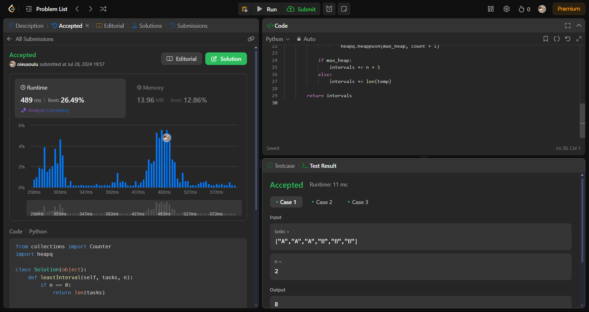
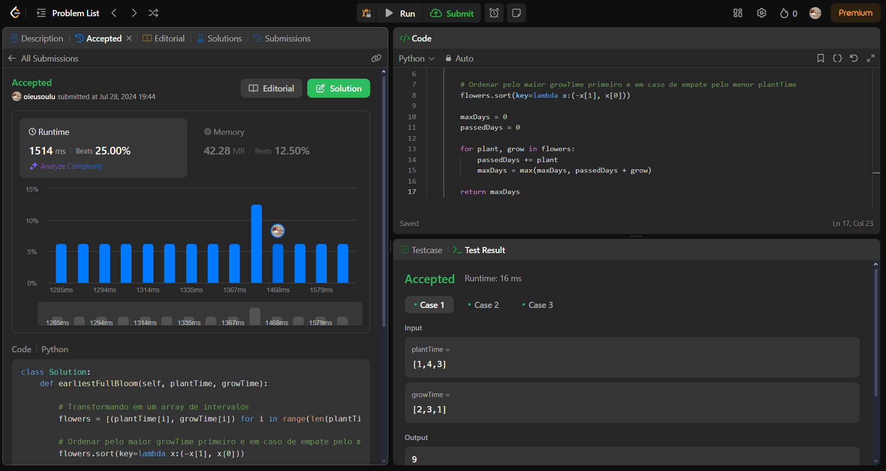
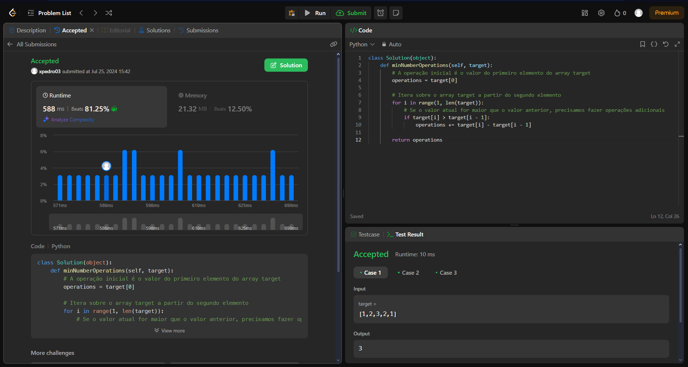

# LeetJudge

**Número da Lista**: 10 
**Conteúdo da Disciplina**: Greed 

## Alunos
| Matrícula  | Aluno                           |
| ---------- | ------------------------------- |
| 22/1007653 | Luciano Ricardo da Silva Junior |
| 21/1031468 | Pedro Victor Salerno Martins    |

## Sobre 
Resolver duas questões dificeis e duas media utilizando os conceitos de algoritimos ambiciosos aprendidos na disciplina de Projetos de Algoritimos da Universidade de Brasilia.

## Video de apresentação
O video de apresentação pode ser encontrado em [link]()

## Screenshots

**Questão 621 após submição**

**Questão 921 após submição**

**Questão 2136 após submição**

**Questão 1526 após submição**

## Instalação

**Linguagem**: Python 
**Framework**: Não tem 

## Uso

Você pode apenas entrar na questão especifica do juiz virtual e fazer a submição.

As questões são:

- [Questão 621](https://leetcode.com/problems/task-scheduler/description/)
- [Questão 921](https://leetcode.com/problems/minimum-add-to-make-parentheses-valid/description/)
- [Questão 2136](https://leetcode.com/problems/earliest-possible-day-of-full-bloom/description/)
- [Questão 1526](https://leetcode.com/problems/minimum-number-of-increments-on-subarrays-to-form-a-target-array/description/)

Alternativamente você pode ter o Python instalado e executar os arquivos de teste.
